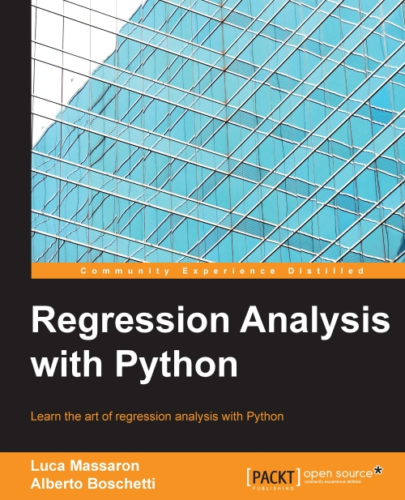

# About Python

Python is a high-level, general-purpose, dynamic programming language that is becoming ever more widespread in the programming world. It is readable, succinct, scalable, and can support multiple programming paradigms. It is now the most common ‘starter’ language taught on university programming courses and is seen by many as the future of coding.

# Regression Analysis with Python

This repository holds the notebooks for the book "Regression Analysis with Python"
by [Luca Massaron](https://www.linkedin.com/in/lmassaron) and  [Alberto Boschetti](https://www.linkedin.com/in/alberto-boschetti-a050b55). You can find details about the book on the  [Packt website](https://www.packtpub.com/big-data-and-business-intelligence/regression-analysis-python).

The books requires the current development version of scikit-learn, that is
0.18-dev.  Most of the book can also be used with previous versions of
scikit-learn, though you need to adjust the import for everything from the
``model_selection`` module, mostly ``cross_val_score``, ``train_test_split`` and ``GridSearchCV``.

## Setup

To run the notebooks, you need the packages ``numpy``, ``scipy``, ``scikit-learn``, ``matplotlib``, and ``pandas``.

The easiest way to set up an environment is by installing [Anaconda](https://www.continuum.io/downloads).

### Installing packages with conda:
If you already have a Python environment set up, and you are using the ``conda`` package manager, you can get all packages by running

    conda install numpy scipy scikit-learn matplotlib pandas 

    
### Installing packages with pip

If you already have a Python environment and are using pip (Python 2) and pip3 (Python 3) to install packages, you need to run

    pip install numpy scipy scikit-learn matplotlib pandas

If you are using OS X and macports, you can ``sudo port install packagename``. If you are on Ubuntu or debian, you can ``apt-get install packagename``.

# Regression-Analysis-with-Python
